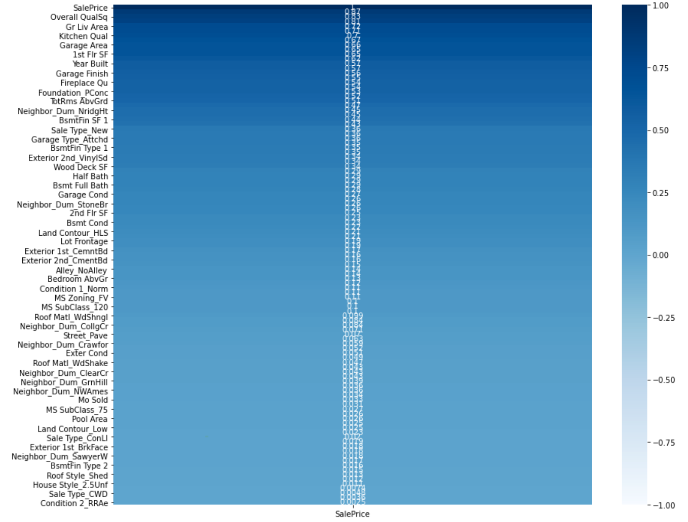
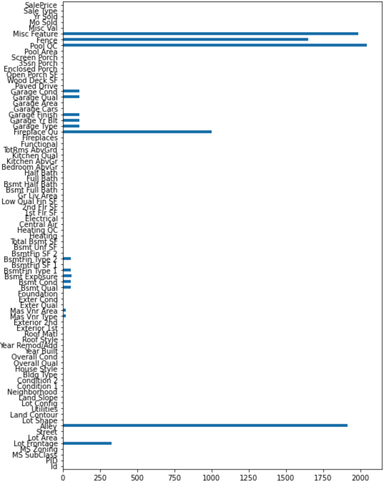

# Project 2: Predicting House Sale Prices with Machine Learning

## Problem Statement
The AMES Housing Data Set represents the amenities of over 2900 properties in Ames, Iowa priced and sold from 2006 to 2010. Over 75 distinct variables divide these amenities into categories. 

The four categories of amenities for each house are categorical, ordinal, discrete, and continuous. Categorical (or nominative) values, such as neighborhood or type of roofing, lack a hierarchy of quality and possess qualitative information. Ordinal values possess a clear hierarchy (like Kitchen Quality (Excellent, Good, Average, Poor)) but still represent qualitative information. Discrete variables are countable (like Number of Cars) and quantitative. Finally, continuous variables are quantitative, measurable, and can contain fractions of values (like Square Footage). 

How can this information be used by Real Estate developers and clients to predict or increase a property's value? Moreover, how can a data scientist use a model to process all of this data?

## Executive Summary
By using the form of Machine Learning called Linear Regression, this project processes through a database of AMES Housing training data. Then, linear regression predicts a house's sale price and value using the training data's trends and properties. Additionally, regression techniques (such as feature engineering and selection) enhance the quality of our predictions.

## Conclusions

One can use linear regression to greatly reduce errors and improve the performance of predicting sale price based on a variety of highly correlated factors. Although, it seems that knowing which factors influence a house's price (such as Kitchen Quality and Bathroom Space) can often be more valuable than the predictive model itself. As a result, even the basic method of Linear Regression can be incredibly useful for a firm's Real Estate pricing decisions.

The interpretability of linear regression (as opposed to more complex models) makes it one of the more easy models to make inferences with. We have the ability to note which features correlate with Sale Price to be able to improve the price. Additionally, we also have the relative correlations of Sale Price with other factors, giving us an actual quantitative idea of how to advise a Real Estate branch on how to recreate their properties.

## Images

  
  

## Contents:

### Informative
- Problem Statement
- Executive Summary

### train_df
- Data Cleaning: Categorical (Nominal) Columns with Null Values - train_df
- Data Cleaning: Continuous Columns with Null Values - train_df
- Data Cleaning: Discrete Columns with Null Values - train_df
- Data Cleaning: Categorical Columns without Null Values (Making Dummies) - train_df
- Data Cleaning: Ordinal Column Mapping
- Data Cleaning: Correlation Heatmap
- Data Cleaning: Continuous Columns with Null Values - train_df
- Exploratory Data Analysis (Identifying/Possibly Dropping Outliers) - train_df
- Feature Engineering - train_df¶
- Model Definition - train_df
- Model and Fit - train_df

### test_df
- Data Cleaning: Categorical (Nominal) Columns with Null Values - test_df
- Data Cleaning: Continuous Columns with Null Values - test_df
- Data Cleaning: Discrete Columns with Null Values - test_df
- Data Cleaning: Categorical Columns without Null Values (Making Dummies) - test_df
- Data Cleaning: Ordinal Column Mapping
- Data Cleaning: Continuous Columns with Null Values - test_df
- Exploratory Data Analysis (Identifying/Possibly Dropping Outliers) - test_df
- Feature Engineering - test_df¶
- Model Definition - test_df
- Model and Fit - test_df

### Exporting Dataframes
- Exporting test_df Dataframes
- Ridge
- LASSO

Conclusions
- Descriptive and Inferential Statistics
- Outside Research
- Conclusions and Recommendations

Data Source
- General Assembly Data Science Immersive 2020
- Kaggle
- https://www.kaggle.com/c/dsir-720-project-2-regression-challenge/overview
- http://jse.amstat.org/v19n3/decock/DataDocumentation.txt