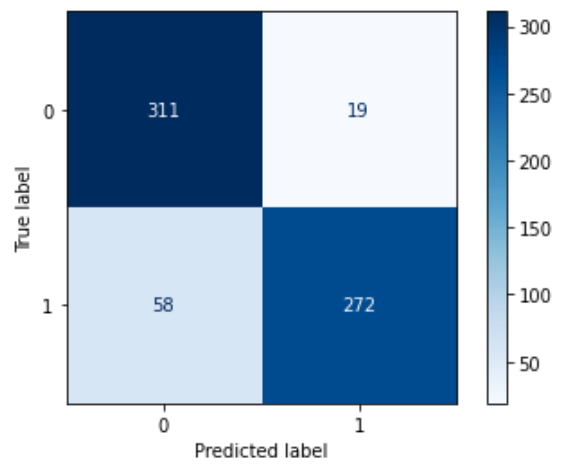
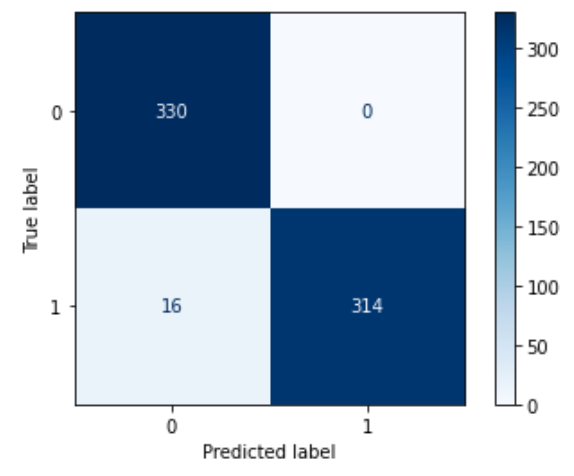
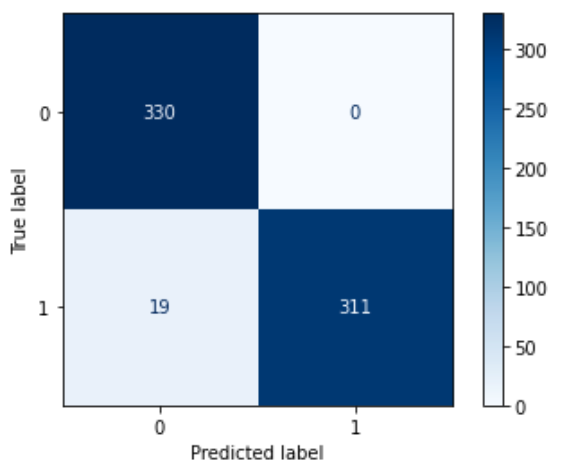

# Project 3: Predicting Dating App Subreddit with Natural Language Processing

## Problem Statement
As a representative of the Match company, providing good customer service is essential to the wellbeing of our dating platform Tinder. As a result, we want to know how similar Tinder and Tinder Stories are as subreddits. Can a logistic regression and other classification form of models accurately predict (< 60-80 % of the time) the difference between a reddit post on a Tinder Stories and one on Tinder? Moreover, what is the most frequent verbal content that Tinder produces on a huge, statistical level? What differentiates the users and contents of Tinder's subreddit from Tinder Stories' subreddit. Finally, what can I recommend for the board of Tinder to do in order to investigate and re-evaluate the reputation of Tinder set by its community of users?

## Executive Summary
By using Natural Language Processing techniques such as Count Vectorizer and four different kinds of classification models, I found out something interesting; heterosexual men would tend to use the Tinder Subreddit to talk about dating women, while heterosexual women would tend to use the Tinder Stories Subreddit to talk about dating men. We can gather this because "removed," "girl," and "girls" are three of the top most popular words in "Tinder" as a subreddit. Likewise, "guy" and "date" are two of the most popular words in "Tinder Stories'" subreddit. 

As most of the Tinder Subreddit posts contain images and most of the Tinder Stories Subreddit posts contain words-indicating that in this environment, these men are more visual and these women are more verbal. The models used can accuratetly predict the differences between posts on each of these subreddits between 87% and 97% of the time, indicating that gendered words and preferences such as these impact our models rather significantly. These gendered words can be used to inform how we build our User Interface more effectively for each group.

## Part 1 Contents:

### Scraping the Tinder and Tinder Stories Subreddits
- In this section, I build a function to scrape 100 posts of data from a given subreddit using the PushShift API. The length of the function allows me to scrape 100 posts multiple times from a subreddit.
### Tinder Scraping
- I use the function pull_posts to scrape the posts I want from "Tinder" (1000 most recent posts), I create a dataframe for the posts, and I clean the data of NaN values.
### Tinder EDA
- I create a train-test-split and use a function to clean the "Tinder" dataframe of stopwords, punctuation, and uppercase letters without dropping the information. I view the stopwords of this particular dataset to determine stopwords to clear out of the combined dataframe in part two of the project.
  
### Tinder Stories
- I use the function pull_posts to scrape the posts I want from "Tinder Stories" (1000 most recent posts), I create a dataframe for the posts, and I clean the data of NaN values.
### Tinder Stories EDA
- I create a train-test-split and use a function to clean the "Tinder Stories" dataframe of stopwords, punctuation, and uppercase letters without dropping the information. I view the stopwords of this particular dataset to determine stopwords to clear out of the combined dataframe in part two of the project.
  
### Concatenate Dataframes
- We need to fuse the "Tinder" and "Tinder Stories" info into one dataframe of 2000 rows in order to be able to work with the data (compare each subreddit with NLP).
  
### Binarize Dataframes
- We need to binarize the subreddit column into either '0' or '1' so our computer can run logistic and other classification models on the data.
### Exporting Dataframes 

## Part 2 Contents:

### Train Test Split
- We will be performing a train-test-split on the data so we can train our data to predict subreddit with a prior training dataset first. Then we can model the test set to check the effectiveness of our training model.
### Tokenizing and Preprocessing Data
- The data needs to be changed into a form that we can work with more easily. Every string needs to be broken into single words with Tokenizer and Beautiful Soup, every word should be lowercase, every punctuation mark should be removed, and stopwords should be removed to make sure the models don't immediately flag one of the subreddits (it would be too easy).
### Count Vectorizer
- So we can get a sum of the most common words in the whole string of every post, we need to vectorize (render into numbers) the string words we are going to use. We will examine the most common words in order to determine what Tinder and Tinder Stories (with stopwords removed) have most in common.
  
### Multinomial Naive-Bayes and Logistic Regression Models
- We will start instantiating and fitting models on our dataset using pipeline and gridsearch to optimize the models to a satisfactory level (100% isn't necessarily needed in this low stakes scenario). We will use the Multinomial Naive-Bayes and Logistic Regression models for this section. In Part 3 of this project, we will use KNN and Random Forest models. We will also perform evaluative statistical metrics on the predictions we make like specificity and sensitivity.
### Naive-Bayes Predictions
- We will perform evaluative statistical metrics on the predictions we make like specificity and sensitivity.
  
### Logistic Regression Predictions
- We will perform evaluative statistical metrics on the predictions we make like specificity and sensitivity.
  

## Part 3 Contents:
### Train Test Split
- We will be performing a train-test-split on the data so we can train our data to predict subreddit with a prior training dataset first. Then we can model the test set to check the effectiveness of our training model.
### Tokenizing and Preprocessing Data
- The data needs to be changed into a form that we can work with more easily. Every string needs to be broken into single words with Tokenizer and Beautiful Soup, every word should be lowercase, every punctuation mark should be removed, and stopwords should be removed to make sure the models don't immediately flag one of the subreddits (it would be too easy).
### KNN and Random Forest
- We will start instantiating and fitting models on our dataset using pipeline and gridsearch to optimize the models to a satisfactory level (100% isn't necessarily needed in this low stakes scenario). We will use the KNN and Random Forest models for this section. We will also perform evaluative statistical metrics on the predictions we make like specificity and sensitivity.
### KNN Predictions
- We will perform evaluative statistical metrics on the predictions we make like specificity and sensitivity.
  
### Random Forest Predictions
- We will perform evaluative statistical metrics on the predictions we make like specificity and sensitivity.
  

## Project Conclusions

  

By investigating each subreddit with gender in mind, we as Tinder creators can adjust our platform to appeal even more to each gender's most statistically frequent thoughts specifically. As the second most common word in the male-dominated subreddit "Tinder" is "removed," we can have Tinder include guidelines for good chatting behavior to prevent males from being blocked. In turn, as a very common word in the female-dominated subreddit "Tinder Stories" is "date," we can include a bio question on our app detailing "Cool First, Second, and Third Date Ideas?" This will allow both genders to be clear about what kind of dating environment is personally ideal for them, raising revenue and helping people find love even more.

Despite the extreme similarities of the subreddits for Tinder and Tinder Stories, classification modeling is a form of supervised machine learning powerful enough to differentiate between these posts with a high degree of accuracy. Due to its analytical interpretability of which words are most popular, classification modeling for natural language processing will let us guide our company into the future with even more stable business decisions based on fact.

# Data Sources
- General Assembly Data Science Immersive 2020
- [Pushshift's](https://github.com/pushshift/api) API
- https://youtu.be/AcrjEWsMi_E
- https://www.reddit.com/r/Tinder/
- https://www.reddit.com/r/tinderstories/